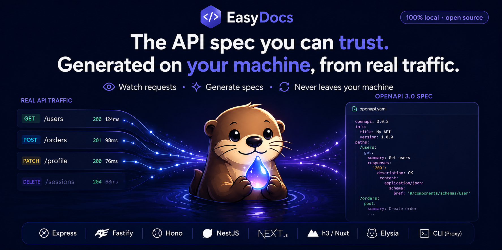

<p align="center">
  
</p>

# EasyDocs

**The API spec you can actually trust — generated on your machine, from real traffic.**

EasyDocs generates accurate, up-to-date OpenAPI 3.0 specs from your API's real traffic, running entirely on your machine with nothing sent to anyone. Add one line; no spec files to write, no annotations to maintain. Your docs describe what the API actually does, not what you thought it did when you last touched the YAML. (Under the hood an AI model turns observed requests and responses into the spec — richer than mechanical type-merging — and you stay in control of what ships.)

## Why EasyDocs

- **Local-first** — your traffic never leaves your machine. No cloud, fully self-hostable.
- **Works fully offline** — point it at a local Ollama model; no API key required, and no model vendor ever sees your data.
- **PII-safe by default** — secrets and personal data (passwords, tokens, emails, card numbers) are detected and redacted before the payload reaches a hosted AI provider, and flagged in the docs.
- **Open-source & free** — no SaaS lock-in, no paywalled features.
- **Framework-native accuracy** — adapters capture true route templates (`/users/:id`), not the concrete URLs (`/users/123`) a proxy sees.
- **Accurate, not mechanical** — an AI model reads real requests and responses to produce richer specs (real descriptions, detected auth schemes), not the bare schema a type-merger infers. Accuracy is measured against hand-written ground truth — see the [benchmark](./BENCHMARK.md).

## Two ways to get started

### Option A — Zero code changes (proxy)

Route your requests through the EasyDocs proxy. Nothing to install in your project.

```bash
npx @easydocs/cli proxy --project=my-api --port=3999
```

Then send requests through the proxy:

```
http://localhost:3999?target=https://api.example.com/users
```

### Option B — Middleware (one line)

```bash
npm install @easydocs/express
```

```ts
import { easydocs } from "@easydocs/express";

app.use(easydocs({ project: "my-api" }));
// all your existing routes stay the same
```

---

## View your docs

```bash
npm install -D @easydocs/dashboard
npx easydocs dashboard
# → http://localhost:4999
```

The dashboard also tracks version history: each endpoint records how its spec evolved over time, with a field-level diff between any two versions.

Or export to a file:

```bash
npx easydocs export > openapi.json
npx easydocs export --yaml > openapi.yaml
```

---

## Track API changes in pull requests

Commit your exported spec (`openapi.json`) and let EasyDocs comment the field-level
changes on every PR. Diff two spec files directly:

The diff is grouped by endpoint and each change is tagged breaking / additive /
non-breaking, so a removed response field reads differently from a description tweak.

```bash
npx easydocs diff old.json new.json                    # human-readable summary
npx easydocs diff old.json new.json --markdown         # PR-comment Markdown
npx easydocs diff old.json new.json --fail-on=breaking # exit 3 on a breaking change
```

`--fail-on` accepts `none` (default, never fails), `breaking` (fail on any breaking
change), or `any` (fail on any change at all).

Or drop in the GitHub Action — it diffs the committed spec against the base branch
and posts a sticky comment (updated in place on each push):

```yaml
# .github/workflows/easydocs.yml
name: API spec diff
on: pull_request
permissions:
  pull-requests: write
jobs:
  spec-diff:
    runs-on: ubuntu-latest
    steps:
      - uses: actions/checkout@v4
      - uses: RubenGlez/easydocs@v1
        with:
          spec: openapi.json
          fail-on: breaking   # optional; default 'none' (comment-only)
```

By default the check is informational — it comments the diff and never fails the
build. Set `fail-on: breaking` (or `any`) to turn it into a review gate that fails
the PR when the spec changes cross that threshold; the comment is still posted.

---

## How it works

1. Middleware (or proxy) intercepts every request and response
2. A background queue feeds the captured data to an AI model — nothing blocks your request
3. The AI generates or updates an OpenAPI 3.0 Operation object for that endpoint
4. Response-shape hashing skips re-processing when the structure hasn't changed
5. Specs are stored in SQLite (default) or Postgres
6. The dashboard reads from that database and renders live docs

---

## Framework adapters

| Package                                   | Framework                            |
| ----------------------------------------- | ------------------------------------ |
| [`@easydocs/express`](./packages/express) | Express                              |
| [`@easydocs/fastify`](./packages/fastify) | Fastify                              |
| [`@easydocs/hono`](./packages/hono)       | Hono                                 |
| [`@easydocs/nestjs`](./packages/nestjs)   | NestJS                               |
| [`@easydocs/nextjs`](./packages/nextjs)   | Next.js (App Router + Pages Router)  |
| [`@easydocs/h3`](./packages/h3)           | h3 / Nitro / Nuxt                    |
| [`@easydocs/elysia`](./packages/elysia)   | Elysia (Bun)                         |
| [`@easydocs/trpc`](./packages/trpc)       | tRPC                                 |
| [`@easydocs/cli`](./packages/cli)         | Proxy + export (no framework needed) |

---

## AI provider setup

Set one environment variable:

```bash
# OpenAI
OPENAI_API_KEY=sk-...

# Anthropic
ANTHROPIC_API_KEY=sk-ant-...

# DeepSeek
DEEPSEEK_API_KEY=sk-...

# Ollama (local, no key needed)
# configure in code: easydocs({ ai: { provider: 'ollama' } })
```

EasyDocs auto-detects the provider from your environment. If no key is set, it falls back to Ollama at `localhost:11434`.

---

## Configuration

```ts
easydocs({
  project: "my-api", // separate spec per service, default: 'default'
  ai: {
    provider: "openai", // 'openai' | 'anthropic' | 'ollama' | 'deepseek'
    model: "gpt-4o",
    apiKey: "...", // optional, falls back to env vars
  },
  storage: {
    type: "sqlite", // 'sqlite' | 'postgres'
    url: "file:./docs.sqlite",
  },
  capture: {
    ignoreRoutes: ["/health", "/metrics"],
    includePaths: ["/api"],
  },
  privacy: {
    enabled: true, // on by default; detect & redact PII/secrets
    placeholder: "[REDACTED]", // value substituted for sensitive fields
    allowlist: ["public_token"], // key names never to flag
    customRules: {
      keyNames: ["internalRef"], // extra sensitive key names
      valuePatterns: ["^INT-\\d+$"], // extra regex value matchers
    },
  },
  dashboard: {
    autoStart: true, // spawn dashboard on first capture (dev only)
    port: 4999,
  },
});
```

Detection is deterministic and fully offline. Values are redacted before being sent
to a **hosted** provider (OpenAI/Anthropic/DeepSeek); with local Ollama nothing leaves
the machine, so real values are kept for accuracy. Flagged fields are marked in the
spec with `x-easydocs-sensitive` and shown with a badge in the dashboard.

---

## Multiple projects

Scope traffic from different services to separate specs:

```ts
// service-a
app.use(easydocs({ project: "users-service" }));

// service-b
app.use(easydocs({ project: "orders-service" }));
```

Switch between projects in the dashboard or scope the export:

```bash
npx easydocs export --project=users-service > users.json
```

---

## License

MIT
